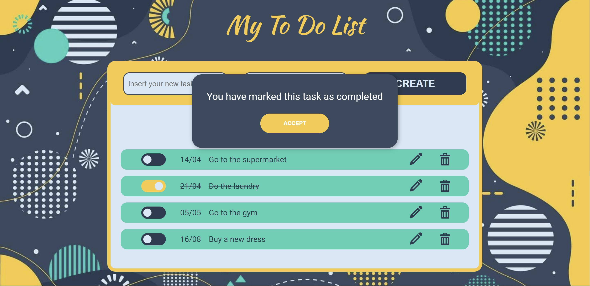
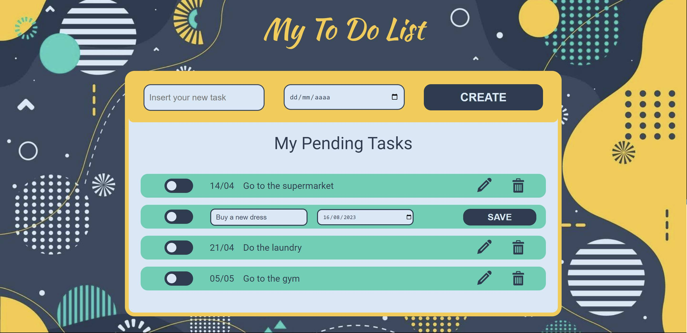

# ToDo List
ToDo List is a web application created as a learning project within the Nuclio Digital School Bootcamp of the June 2023 cohort. It fetches data from an API and displays it in a list format for the user, while also allowing complete management of the tasks.

## Table of Contents

1. Project Description
2. Application Walkthrough
3. Technologies Used
4. Installation
5. Project Manager

# Project Description
ToDo App is a simple yet visually appealing application that displays a list of user's pending tasks, showing their respective deadlines. It also allows users to edit task details, mark tasks as completed or uncompleted, and delete tasks if desired.

The frontend is entirely built using React and CSS, connected to a custom REST API to display data on the screen.


# Application Walkthrough
### GET
The application displays a pre-existing list from the database, which the user can modify as needed.


### POST
At the top, there's a form for creating a new task, which will be displayed below. Tasks are sorted by date, so if the deadline of an existing task is delayed, it will automatically move to the bottom of the list.

 


### PATCH
Each task has a toggle button to mark or unmark it as completed. The button's color changes when the task is completed, and the task text is crossed out. A message will notify the user that the task has been marked as completed. If the user wants to revert it to pending, they can simply press the button again, and a new message will indicate that the task has been marked as pending, removing the strikethrough effect.



Furthermore, both the date and task text can be edited using the pencil button, which opens an editing menu overlaying the current data, allowing the user to enter new information. After making the changes, clicking the save button will automatically update the data and display a message confirming the successful edit.




### DELETE

Next to the edit button, there's a trash can icon that enables the deletion of the selected task. In case of regrets or accidental clicks, the user can cancel the deletion or confirm it. The task will be removed from the list automatically without the need to refresh the page.


# Technologies Used
### Main Front-End Libraries:

* React
* React-Date-Range
* React-Hook-Form

### Main Back-End Libraries:

* Express

# Installation
## 1. Prerequisites

To run ToDo List locally, you need to have installed:
* Node.js

## 2. Configuration:

* Clone this repository to your local machine:
````
$ git clone https://github.com/Ananke85/ToDoApp.git
````
* Install project dependencies on each folder (Front-end & Back-end):
```
$ npm install
````
* The server is running in the next port:
```
PORT: 3000
````
* Open a terminal and start the server:
```
$ cd backend
$ npm start
````
* Open a different terminal and start the client:
```
$ cd todolist
$ npm run dev
````
* Open a web browser and go to the following port to view the application:
```
http://localhost:5173/
```
# Project Lead
Lorena Carmona
